# Getting Started Kafka

## Kafka Overview

Problems with traditional messaging system

- Limited Scalability (due to messaging broker)
- Smaller messages 
- Requires rapid consumption
- Not fault-tolerant (application)

Perils of Messaging Under High Volumne

### Bad consumer exploding the queue

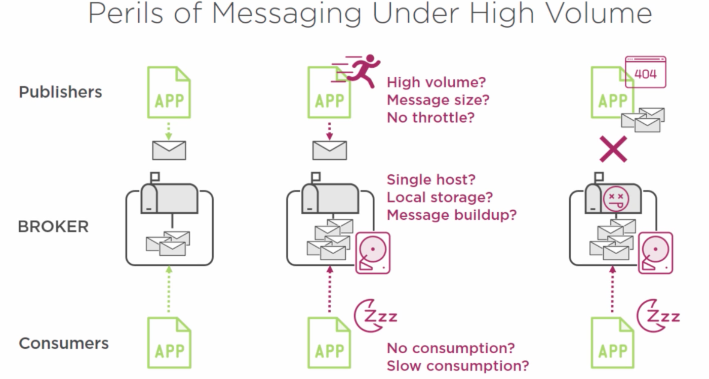

### Bad Message. Can't retrieve something that's already consumed

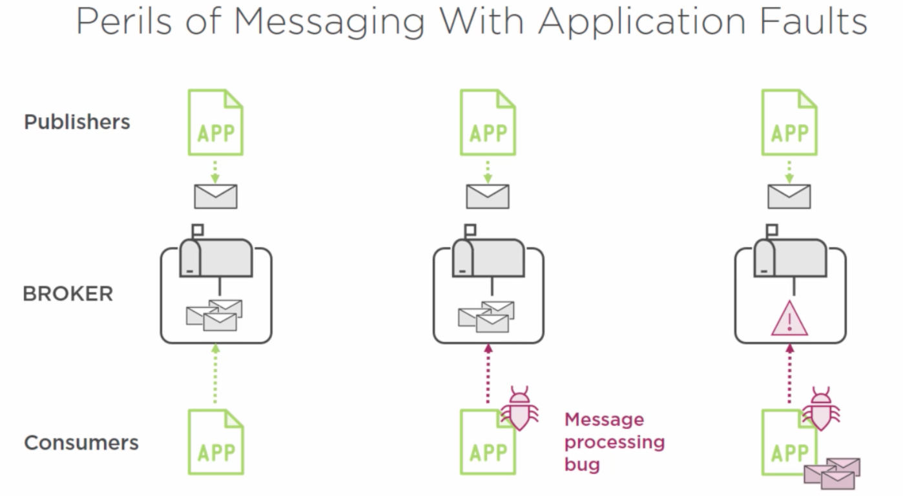

And... You probably don't want to write your own middleware that does multi-phase commit that gurantees integrity of data. This will be very complex and hard to maintain.

Kafka should solve...

- High Throughput
- Horizontally Scalable
- Reliable and Durable
- Loosely coupled Producers and Consumers
- Flexible publish-subscribe semantics

## Kafka Architecture

Publish-Subscribe Messaging system

Producers -> Topic -> Consumer

If producer has the name and the appropriate permission to write to a topic. It can publish a message. Consumer can retrieve a message from the topics that it is interested in.

Kafka keeps and maintain the topic in its broker.

### Kafka broker

Increase the # of broker to achieve the needed throughput. (i.e. LInkedIn has 1400 brokers for 2 petabytes per week)

Kafka cluster is a grouping of Kafka brokers.

``` bash
# start zookeeper
bin/zookeeper-server-start.sh config/zookeeper.properties

# starts kafka server
bin/kafka-server-start.sh config/server.properties

#create kafka topic
bin/kafka-topics.sh --create --topic my_topic -zookeeper localhost:2181 --replication-factor 1 --partitions 1

#list of kafka topic
bin/kafka-topics.sh --list --zookeeper localhost:2181

#producer
./kafka-console-producer.sh --broker-list localhost:9092 --topic my_topic

#consumer 
./kafka-console-consumer.sh --zookeeper localhost:2181 --topic my_topic --from-beginning
./kafka-console-consumer.sh --zookeeper localhost:2181 --topic my_topic

#describe topic
bin/kafka-topics.sh --zookeeper localhost:2181 --describe --topic my-topic
```

### Distributed Systems

- Collection of resources that are instructed to achieve a specific goal or function. 
- Consist of multiple workers or nodes. 
- The system of nodes require coordination to ensure consistency and progress toward a common goal. 
- Each node communicate with each other through messages

Each node or worker in Kafka world is the broker.

Broker has some kind of hierarchy, and it has a controller that officiates.

Controller needs to..

- Needs to know which workers are available for work
- Maintain list of work items that are assigned and committed to workers
- Maintains active status and progress of workers and its work

When the task comes in, controller makes the decision which worker will take the job. Therefore it needs to know...

- Worker availablity and health.
    - What risk policy does it follow? (i.e. replication factor)

### Communication and Consensus

Distributed system need to communicate for...

- Worker node membership and naming
- Configuration managment
- Leader election
- Health status

Zookeeper does this!

Centralized service for maintaining metadata about a cluster of Distributed nodes.

It take cares of these things.

- Configuration information
- Health status
- Group membership

Distribute system consisting of multiple nodes in an "ensemble". If you have one ensemble, you can power one or multiple kafka clusters.
It will serve metadata that a Kafka cluster requires.

## Kafka Topic, Partition, and Brokers

### Topic

- Named feed or category of messages
    - Producers produce to a topic
    - Consumers consume from a topic.
- Logical Entity
- Physically represented as a log

When Producer sends a message, it gets appended to the time-ordered sequential stream.
Each stream represents immutable facts or events which are worthwhile to preserve. Cannot be changed after published.
If a message is not right, you would have to follow up with more correct one afterward. Consumer's job to reconcile.

This is following architectural style of event sourcing

- An architectural style or approach to maintaining an application's state by capturing all changes as a sequence of time-ordered, immutable events.

Each message has a :
- Timestamp
- Referenceable Identifier
- Paylaod (binary)

How does consumer maintains autonomy from same message topic?

With message offest. Message offset allows consumers to process data at their own pace. 

It's essentially a placeholder.

- Last read message position.
- Maintained by the Kafka consumer
- Corresponds to the message identifier. (Referenceable Identifier)

Consumer connects to a broker. Consumer then decides which message that it wants to read by selecting the offset. If it want to start from the start, the offest is 0. 
Or it can read from last offset recorded.

Kafka retains all published messages regardless of consumption.

- Retention period is configurable by hours
    - Default is 168 hours or 7 days
- Retention period is defined on a per-topic basis
- Physical storage resources can constrain message retention

If you think about it. Topic works similar to transaction/commit logs

- source of truth
- physically stored and Maintained
- Higher-order data structures derive from the log
    - Tables, indexes, views, etc.
- Point of recovery
- Basis for replication and distribution

### Kafka Partitions

Each topic has one or more log file called partitions.

A partition is the basis for which Kafka can:
- Scale
- Become fault-tolerant
- Achieve higher levels of throughput

Each partition is maintained on at least one or more Brokers

Each partition must fit entirely on one machine

In general scalability of Kafka is determined by the number of partitions being managed by multiple broker nodes.

If a topic has three partitions, we are essentially asking a topic to be split into 3 log files (partition) ideally managed by 3 different broker nodes.
Each partition is mutually exclusive from each other. They receive unique messages from producer from the same topic.

Kafka producer has partitioning scheme to determine which partition it's going to pick.

When topic is created. Zookeeper then looks at the available brokers and which decide which will be leaders who will be responsible for the partitions.
After that new log files for partition will be created. Also each indivisual brokers will get some he metadata from the Zookeeper. 
Particularly the mappig of which partitions is managed by which brokers. So any random broker knows where a specific partition belongs to which broker.

Status check is then sent to Zookeeper by each broker, so proper consensus can be maintained.

When the producer sends the message, it needs to at least know one broker to find out a leader of the partition.

Consumer also consumes messages similarly. Also, consumer is responsible for handling different order problem. (this is likely to happen if there are multiple partition)

Partitioning trade-offs
- The more partitions the greater the Zookeeper overhead
    - can be avoided with larger partition numbers ensure proper ZK capacity
- Message ordering can become complex if you need global order.
    - Single partition for global ordering
    - Consumer-handling for ordering
- The more partitions the longer the leader fail-over time.

When Kafka leader is down, Zookeeper finds another broker to replace it. Metadata will be updated and consumer and producer will get the updated metadata.
But if it goes down with data, your can get replicated data. 2 or 3 minimum replication factor is 2 or 3 minimum. Replication factor is configured per topic.

Leader is responsible for replicating the data with peer brokers in a quorom fashion. In-sync-replicas (ISR) will be communicated within a quorom.

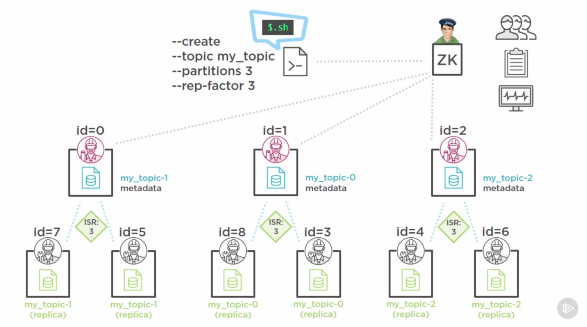

If ISR falls below the replication factor, investigation is required instead of blindly replacing it. It might be planned or not.


## Producing message with Kafka Producers

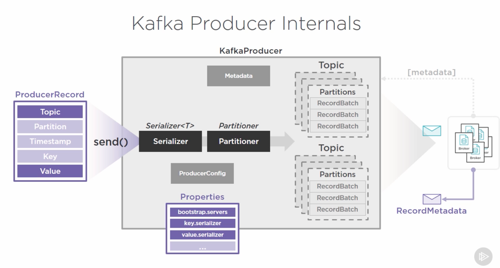

Creating a Kafka Producer.

A producer needs three configs.

- bootstrap.servers
    - Cluster membership: partition leaders, etc.
- key.serializer
- value.serializer
    - Classes used for message serialization and deserialization
    - StringSerializer is commonly used one.

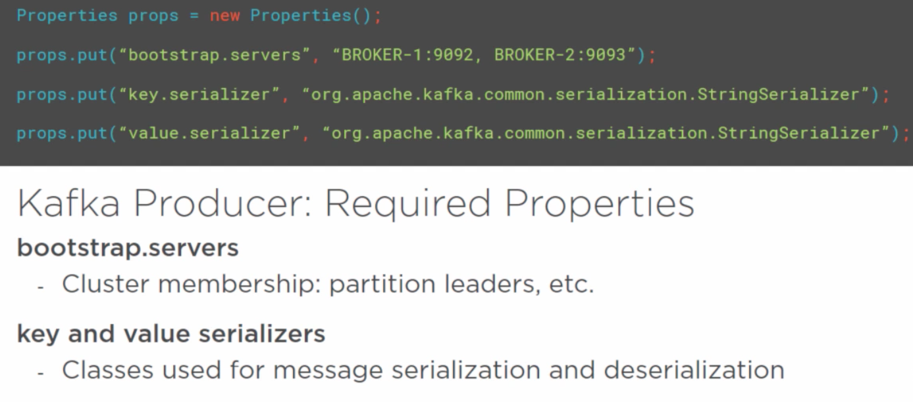

Easiest way to do it is to use Properties class.

``` java
public class kafkaProducerApp {
    public static void main(String[] args) {
        Properties props = new Properties();
        props.put("bootstrap.servers", "BROKER-1:9092, BROKER-2:9093");
        props.put("key.serializer", "org.apache.kafka.common.serialization.StringSerializer");
        props.put("value.serializer", "org.apache.kafka.common.serialization.StringSerializer");

        KafkaProducer myProducer = new KafkaProducer(props);
    }
}
```

Producer produces ProducerRecord (aka message)

Needs two values.
- Topic
- Value (Message content matching the serializer type for value)
Optional values
- Partition
    - specific partition within topic to send ProducerRecord
- Timestamp
    - the Unix timestamp applied to the record.
    - log.message.timestamp.type = [CreateTime, LogAppendTime] 
        - CreateTime: producer-set timestamp used. Even if you ignore this, producer will automatically set this and will be on the commitlog
        - LogAppendTime: broker-set timestamp used when message is appended to commit log.
- Key
    - a value to be used as the basis of determining the partitioning strategy to be employed by the Kafka Producer.
    - serves two useful purposes
        - additional information in the message
        - can determine what partitions the message will be written to
    - downside
        - additional overhead
        - depends on the serializer type.

``` java
props.put("value.serializer", "org.apache.kafka.common.serialization.StringSerializer");
ProducerRecord myMessage = new ProducerRecord("my_topic", "my message");
```


``` java
public class kafkaProducerApp {
    public static void main(String[] args) {
        Properties props = new Properties();
        props.put("bootstrap.servers", "BROKER-1:9092, BROKER-2:9093");
        props.put("key.serializer", "org.apache.kafka.common.serialization.StringSerializer");
        props.put("value.serializer", "org.apache.kafka.common.serialization.StringSerializer");

        KafkaProducer myProducer = new KafkaProducer(props);
        ProducerRecord myRecord = new ProducerRecord("my_topic", "Course-001", "My Message");
        myProducer.send(myRecord); // Best practice: try catch
    }
}
```

When send method is called, it reaches out to cluster using bootstrap server list. Response comes back with metadata involving brokers, cluster, topics and partitions. 
This metadata will be resides for the lifecycle and will be refreshed.

Producer then pass the message to the serializer to encode the message. Then goes to paritioner which determines which partition will the records go. 
This will be determined by content of the producer record (partition), what information is available to the producer, etc...

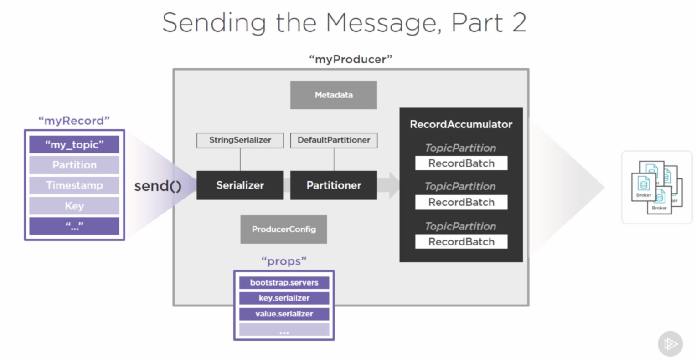

Partitioning Startegy

- direct
- round-robin
- key mod-hash
- custom

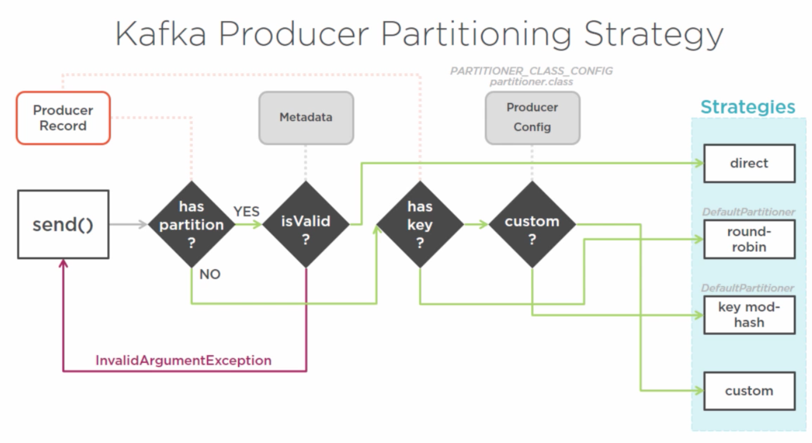

### Record accumulator is queue like in memory data structure. Producer message goes here. It gives the ability to micro-batch in Kafka producer.

Small, fast batches of messages:
    - sending (producer)
    - writing (broker)
    - reading (consumer)

Modern OS functinos:
    - Pagecache
    - Linux sendfile() system call (kernal)

Amortization of the constant cost.

### Message Buffering

RecordBatch's size threshold is batch.size
Collection of RecordBatch's size threshold is buffer.memory and there is max.block.ms (max ms for send method will be blocked for) for time threshold.

linger.ms is the time that the not full RecordBatch waits around before sending.

When producer sends the partitions consist of RecordBatch. it will get RecordMetadata object back wehether it was successful or not.

### Delivery Guarantees

Broker acknowledgement ("acks")
- 0 : fire and forget
- 1 : leader acknowledgement
- 2 : replication quorum acknowledgement

Broker responds with error
- "retries"
- "retry.backoff.ms" (time that it waits before retry)

Message order by partition
    - No global order across partition
Can get complicated with errors
    - retries, retry.backoff.ms
        - First fails, second message arrives, and then first message's retrial arrives
    - max.in.flight.request.per.connection
Delivery semantics
    - At-most-once, at-least-once, only-once

### Advanced Topics Not Covered

Custom Serializers - why and How
Custom Partitioner - why and How
Asynchronouse Send
Compression
Advanced Settings

## Consuming message from Kafka

A consumer needs three configs. (same as producer)

- bootstrap.servers
- key.deserializer
- value.deserializer

### Subscribing to Topics

``` java
public class KafkaConsumer {
    public static void main(String[] args) {
        Properties props = new Properties();
        props.put("bootstrap.servers", "localhost:9092,localhost:9093");
        props.put("key.deserializer", "org.apache.kafka.common.serialization.StringDeserializer");
        props.put("value.deserializer", "org.apache.kafka.common.serialization.StringDeserializer");

        KafkaConsumer myConsumer = new KafkaConsumer(props);
        // initial subscription
        myConsumer.subscribe(Arrays.asList("my-topic"));
        // can use regex
        myConsumer.subscribe("my-*")

        //unsubscribe
        myConsumer.unsubscribe();
        //or
        myConsumer.subscribe(Arrays.asList());
    }
}
```

subscribe()
    - For topic (dynamic/automatic)
    - One topic, one-to-many partitions (poll from multiple partitions)
    - many topics, many more partitions

assign (subscribe to a specific partition)
    - For partitions
    - One or more partitions, regardless of topic
    - Manual, self-administering mode

### Single Consumer Topic Subscriptions

Consumer constantly polls for new messages in the topic. That could be a lot of polling depending on the # of toptics and # of partitions.

Subscribe, though, deals with partition management for you. (When a new partition is added, etc.)
Assign specifically deals with which partitions that it wants to listen to. (topic is kinda disregarded...)

### Poll loop

Primary function of the Kafka consumer. 
- poll()
Continuously polling the brokers for data.
Single API for handling all Consumer-Broker interaction
    - Beyond just message retrieval!

``` java
try {
    while(true) {
        ConsumerRecords<String, String> records = myConsumer.poll(100);
        //Your processing logic goes here...
    }
} finally {
    consumer.close();
} 
```

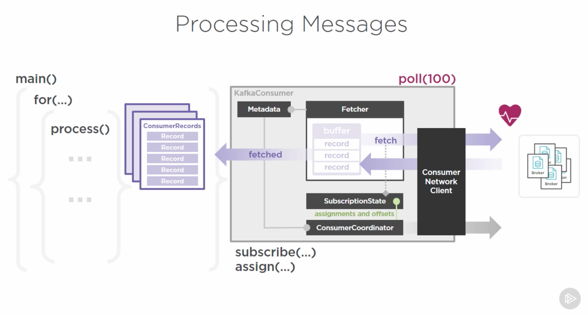

SubscriptionState is the source of truth for details of partitions that the consumer is consuming from. This object also interact wit ConsumerCoordinator to manage offset

when poll is invoked, consumer setting (boostrap.server) used to get the required metadata. Fetcher is the object responsible to get data from consumer and the cluster via Consumer Network Client.
Metadata and heartbeat is exchanged. Metadata object is used by ConsumerCoordinator to interact with SubscriptionState. ConsumerCoordinator is responsible if there is any change due to automatic/dynamic partition reassignment.
Committing offset, updating SubscriptionState.

Arg to poll method is the timeout setting. # of millisecond the network client will spend before returning. ConsumerRecords are returned after timeout.

poll() process is a single-threaded operation. So some troubling thing will happen if it takes a lot of time to process the message.

### More about Offset

Offset is super important. This ensure the data integrity.

Just using default setting, it does auto-commit for 5 seconds. So if for some reason your processing logic takes more than 5 seconds, your data may not be reliable.

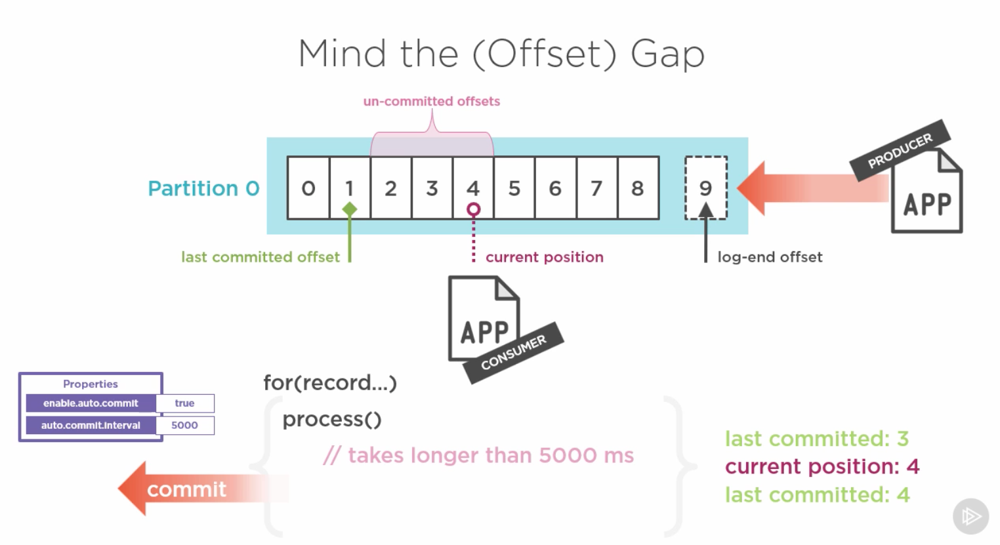

Eventual consistency is common. So it is okay to be eventual consistency.

What if it takes more than 5 seconds and then error occurs? It may be messy to find out what the offest would be due to auto commit

Read != Committed.

Offset commit behavior is configurable
- enable.auto.commit = true (default)
- auto.commit.interval.ms = 5000 (default)
- auto.offset.reset = "latest" (default) <- When consumer is reading from the new partition
    - "earliest"
    - "none" (Throw an error and deal with it)

Single Consumer vs Consumer Group

Consumers track the offset in a special topic called "__consumer_offsets" with 50 partition. ConsumerCoordinator is the one who update this topic.

### Offset Management

Automatic vs Manual
- enable.auto.commit = false
Full control of offset commits
- commitSync()
    - when precise control over when a record is truly processed.
    - when higher consistency is required. Also when you dont want to deal with another batch of records when you have one on your hand
    - call it when a batch of your consumer is all processed.
    - Synchronous
        - blocks until receives response from cluster
    - Retries until succeeds or unrecoverable error
        - retry.backoff.ms (default:100)

``` java
try {
    for(...)
    myConsumer.commitSync();
} catch (CommitFailedException) {
    log.error("...")
}
```

- commitAsync()
    - Asynchronous
        - non-blocking but not-deterministic
    - no retries
    - callback option

``` java
try {
    for(...)
    //not recommended
    myConsumer.commitAsync
    //recommended
    myConsumer.commitAsync(new OffsetCommitCallback() {
        public void onComplete(..., ..., ...) { //dosomething 
        }
    });
}
```

When consumer commit in process. Goes to ConsumerCoordinator which will update offset topic via ConsumerNetworkClient and update SubscriptionState. 
Fetcher then receive the update and know which record to retrieve.

Consistenct Control
- When is done?
Atomicity
- Exactly once vs At-least-once

### Scaling out Consumers

Consumer Groups

Kafka's solution to consumer-side scale out
Independent Consumers working as a team
- "group.id" setting
Sharing the message consumption and processing load
- parallelism and throughput
- redundancy
- performance

There is a broker called GroupCoordinator who monitors consumers in consumer group membership. Responsible that the load is truly balanced among all consumer. 

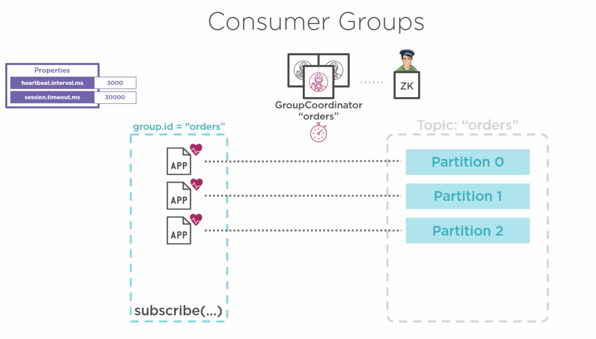

each consumer in consumer group sends out heartbeat message in heartbeat.interval.ms. GroupCoordinator severs the connection after session.timeout.ms.

If consumer goes down, the GroupConsumer reassign the partition to other consumer. (aka Consumer Rebalance) The consumer will pick the offset up and try to process the latest message.
This is why offset management is important!

When new partition comes in, rebalance happens also!

### Consumer Group Relanacing

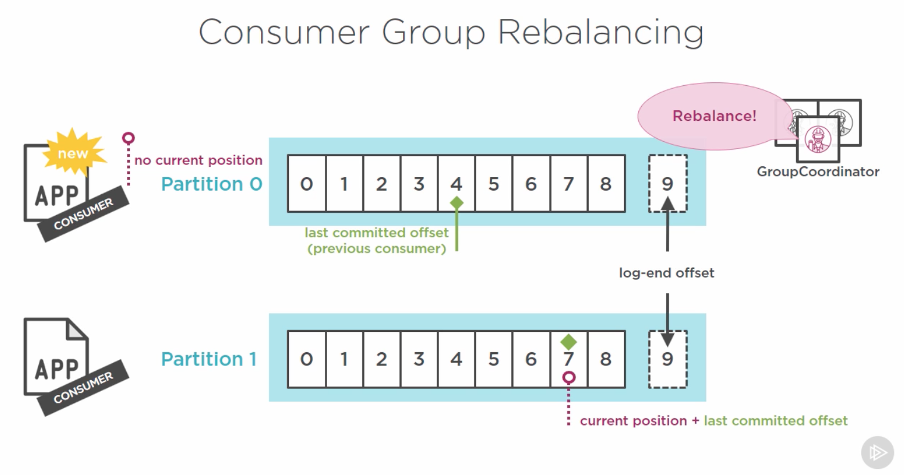

Group Coordinator

Evenly balances available consumers to partitions
- 1:1 Consumer-to-partition ratio
- Can't avoid over-provisioning. (if 4 consumer, and 3 partition, one consumer becomes idle)
Initiates the rebalancing protocol
- Topic changes (partition added)
- Consumer failure

### Consumer Advanced Topic

- Consumer Performance and Efficency
    - fetch.min.bytes (min bytes must be returned from the poll)
    - max.fetch.wait.ms (time to wait if there isn't enough data by fetch.min.bytes)
    - max.partition.fetch.bytes (to prevent seesion timeout)
    - max.poll.records ((to prevent seesion timeout)

Consumer position control
- seek()
- seekToBeginning()
- seekToEnd()

Flow control
- pause()
- resume()

Rebalance listeners()
- how you want to manage rebalance


## Kafka Ecosystem


### Kafka Schema Registry
Tries to solve growing complexities when multiple producers are available. (has to keep up which serializers, message compatibility, message format)

- Apache Avro serialization format
- First-class Avro serializers and deserializers
- Schema registry and version management
- RESTful service discovery
- Compatibility broker

### Challenges with consistency and productivity

Common framework for integration
- standarization of common approaches
- producers and consumers
Platform connectors
- Oracle, HP, etc
- 50+ and growing
Connector Hub

### Challenges with Fast data

Kafka Streams

Leverages existing Kafka machinery
Single infrasturctore solution
- At least for streaming-based processing
Embeddable within existing application
